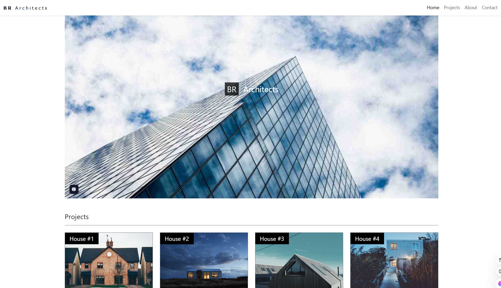

# My One-Page Bootstrap Website



## About

This project is a single-page website built with [Bootstrap](https://getbootstrap.com/). It features a modern design and responsive layout, making it suitable for various screen sizes.

## Features

- Fully responsive design
- Built using Bootstrap 5
- Clean and minimalistic layout
- Based on a W3.CSS template for inspiration


## Getting Started

Follow these steps to set up and run this project locally.

### Prerequisites

Ensure you have the following installed:

- A modern web browser (e.g., Chrome, Firefox)
- [Optional tools like Node.js or a live server if required]

### Installation

1. Clone the repository:

   ```bash
   git clone https://github.com/yourusername/your-repo-name.git
